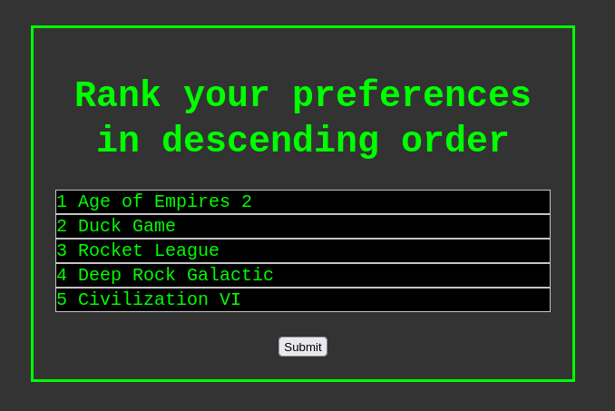

> ranked preferences resolver



"*Our masters have not heard the people's voice for generations and it is much, much louder than they care to remember.*" - V for Vendetta, Alan Moore

## Installation and Usage

The server is written in Python 3 using the [Flask](https://flask.palletsprojects.com/en/2.1.x/) micro web-framework.

First download the code and setup a virtual environment with the required packages:

```csh
% git clone https://github.com/lewis-weinberger/rpr.git
% cd rpr
% python3 -m venv venv
% source venv/bin/activate.csh # or activate if using bash
(venv) % pip install -e .
```

The server can then be run with:

```csh
(venv) % python rpr.py
```

This should start serving on port 5000. **Warning**: this uses the Flask development server.

To exit the virtualenv use the `deactivate` command:

```csh
(venv) % deactivate
% # back to where you started
```

## License

[MIT](./LICENSE)
